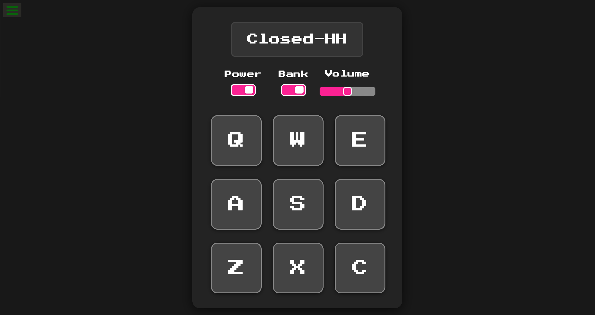

# 🥁 Drum Machine

A React-based drum machine built as part of the [freeCodeCamp Front End Development Libraries Certification](https://www.freecodecamp.org/learn/front-end-development-libraries/#front-end-development-libraries-projects).  
Play sounds by clicking the pads or pressing keys on your keyboard.

---

## 🔗 Live Demo

👉 [View App Live]([https://drum-machine-nu-amber.vercel.app/])

---

## 🖼️ Interface Preview



---

## ✅ User Stories (freeCodeCamp Requirements)

- [x] **#1:** App contains a container with `id="drum-machine"`.
- [x] **#2:** Inside it, a `#display` shows the name of the sound.
- [x] **#3:** There are 9 clickable `.drum-pad` elements: `Q`, `W`, `E`, `A`, `S`, `D`, `Z`, `X`, `C`.
- [x] **#4:** Each pad contains an `<audio>` tag with `class="clip"` and an `id` matching the letter.
- [x] **#5:** Clicking a pad plays its sound.
- [x] **#6:** Pressing the key also plays the corresponding sound.
- [x] **#7:** Triggering a pad updates the `#display` with the sound name.

---

## 🧠 Features

- 🔉 Keyboard and mouse control
- 📺 Dynamic display of sound name
- 🎹 Responsive grid layout
- ⚛️ Built with React + Vite

---

## 🧩 Tech Stack

- React (with hooks)
- Vite (lightweight build tool)
- HTML5 Audio
- CSS or Tailwind (your choice)
- FreeCodeCamp Test Bundle

```html
<!-- This goes in public/index.html -->
<script src="https://cdn.freecodecamp.org/testable-projects-fcc/v1/bundle.js"></script>
